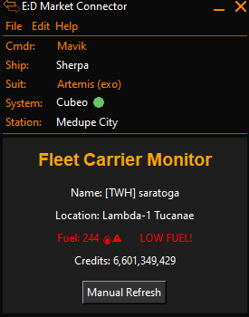
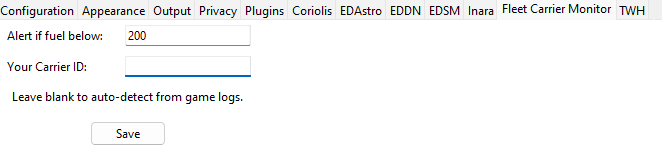
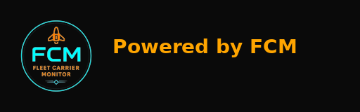

Fleet Carrier Monitor
Fleet Carrier Monitor is a plugin for EDMarketConnector (EDMC) that tracks your Fleet Carrier status in Elite Dangerous in real time.
It provides critical information directly inside the EDMC interface and alerts you if your fuel gets low.

👉 [Download the latest release](https://github.com/mavik77/fleet-carrier-monitor/releases/latest)

✅ Current Features (as of v1.10)

🧾 Saves data to fc_status.csv for persistent state across EDMC restarts.

🪪 Auto-detects Carrier ID from log file.

✏️ Optional manual Carrier ID override from settings (for testing/edge cases).

✏️ Entry was renamed to EntryMenu by @Stumpii in #1

🐞 Logs all debug messages to fcm_debug_log.txt in plugin folder.

🆕 Changelog
v0.3.1 – Dependency Fix (Thanks @Stumpii)

🔧 Replaced deprecated nb.Entry with nb.EntryMenu to fix compatibility with latest EDMC versions.

v0.3.0 – Settings Tab Added

⚙️ New tab in EDMC settings to let users define fuel alert threshold.

💾 Settings persist between sessions.

v0.2.0 – Fuel Alert System

🔥 Shows fuel warning if below threshold (red text + emoji)

✨ Manual refresh button

v0.1.0 – Initial Version

🚀 Displays name, fuel, credits, and location of your FC

## 🖼️ Preview

Here's how Fleet Carrier Monitor looks in EDMC:

✨ Features
Displays live data:

✅ Carrier name

✅ Current system (location)

✅ Fuel level

✅ Credit balance

🔁 Automatically refreshes every 30 seconds

🔔 Low fuel warning with color change, emojis, and blinking label

⚙️ Configurable fuel alert threshold via EDMC settings tab

### ⚙️ Settings Tab (fuel alert threshold)

💾 Saves last known data to CSV

📥 Loads previous session on EDMC startup

📦 Installation
Download or clone this repository.

Copy the fleetcarriermonitor folder into your EDMC plugins directory:

Example path (Windows):

makefile
Copy
Edit
C:\Users\YourUsername\AppData\Local\EDMarketConnector\plugins
Launch EDMC.

Go to Settings → Settings..., find the FleetCarrierMonitor tab.

Set your preferred fuel alert threshold and click Save.

Restart EDMC for changes to apply.

🧠 How it works
The plugin reads from EDMC journal events (e.g., CarrierStats) and directly from the latest journal logs to detect CarrierLocation.

When fuel drops below your defined threshold, the plugin highlights the fuel label in red and displays 🔥⚠️ warnings.

All data is stored in:

fc_status.csv → last carrier data

fleetcarrier_config.json → your fuel threshold setting

💡 Roadmap (Ideas for the Future)
 Jump history log

 Export to Discord via Webhook

 Optional sound alert on low fuel

 Support for cargo manifest (CarrierTradeOrder)

 Data export to Inara or EDSM

📜 License
This project is licensed under the MIT License.
You are free to use, share, and modify it.

👉 [Download the latest release](https://github.com/mavik77/fleet-carrier-monitor/releases/latest)

